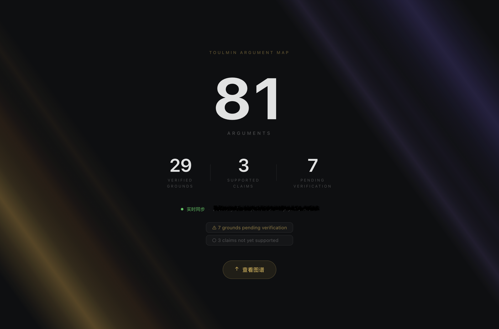

# Toulmin MCP Server

让 AI Agent 以**论证结构**推进科学研究——而不是靠自由发挥。

---

## 它解决什么问题

AI Agent 做科研时容易出现两个问题：结论浮在空中没有证据支撑，或者遇到矛盾就悄悄改掉原来的主张。Toulmin MCP 给 Agent 提供一套**持久化的论证图**：每个主张（Claim）必须有证据（Ground）和推理链（Warrant），矛盾记录为 Rebuttal 而非抹掉，状态推进前必须通过逻辑审查（compile）。

适合的场景：**论文复现、假设验证、多步骤科学推理**。



---

## 接入 Claude Code（Plugin 方式，推荐）

**1. 克隆并配置**

安装 [Bun](https://bun.com/docs/installation)（>= 1.0.0），然后：

```bash
git clone <this-repo>
cd toulmin-mcp

# 可选：启用 LLM 逻辑审查
cp review.json.example review.json
# 编辑 review.json，填入 apiKey
```

**2. 注册 marketplace（每台机器只需一次）**

```bash
claude plugin marketplace add $(pwd)
```

**3. 在你的项目里安装 plugin**

```bash
cd your-project
claude plugin install toulmin-mcp@toulmin-mcp --scope local
```

启动后自动以 `toulmin-researcher` 为主 Agent，MCP server 随之拉起。

启用 LLM 审查后，创建节点时自动触发节点定义审查，`compile_arguments` 执行完整逻辑链审查。

---

## 包含的 Agents

| Agent | 作用 |
|-------|------|
| `toulmin-researcher` | 主力 Agent。构建和验证论证图，识别结构缺口，驱动每个 Claim 走向有据可查的结论。 |
| `toulmin-explorer` | 只读浏览。快速查找节点、查看验证状态、探索论证结构，不做修改。 |
| `toulmin-translator` | 翻译层。将自然语言指令转为结构化操作，路由给 researcher 或 explorer。 |

---

## 包含的 Skills

| Skill | 触发方式 | 作用 |
|-------|----------|------|
| `paper-reproduce` | `/paper-reproduce` | 论文复现工作流。构建独立论证图，逐步验证论文主张是否成立。 |
| `declare-barrier` | `/declare-barrier` | 形式化声明任务阻塞。声明无法继续前，系统检查所有已知的假性阻塞模式。 |
