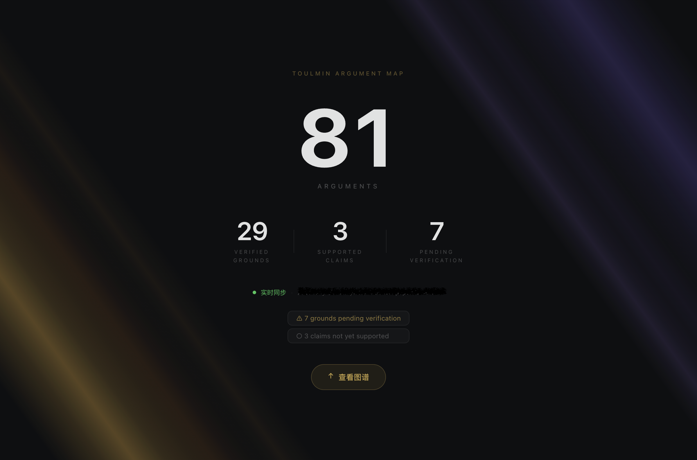
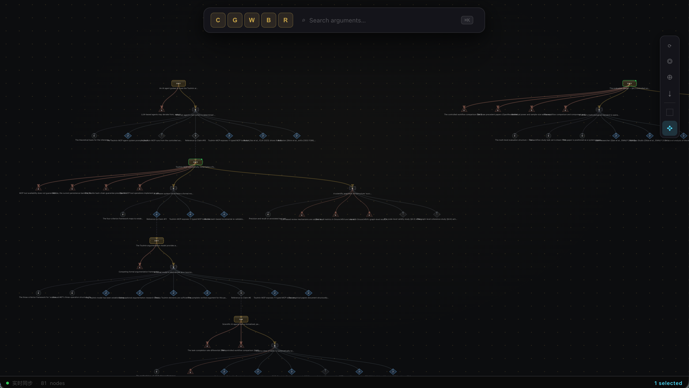

# Warranted

Make AI research agents accountable — give every conclusion a traceable argument graph.

[](https://github.com/yqi96/warranted/releases)
[](LICENSE)


[](https://github.com/yqi96/warranted/stargazers)

> [English](README.md) | [简体中文](README.zh-CN.md)

> **Coding agents have compilers and tests. Research agents have Warranted.**

---

## The problem

AI coding agents converge because compilers and tests provide objective failure signals. Research has no equivalent — conclusions live in natural language with no external verifier, so agents routinely declare work complete with no way to know what's missing.

**Warranted** fills that gap. It gives AI agents a persistent argument graph where every Claim requires Grounds and a Warrant, contradictions are recorded as Rebuttals rather than erased, and status can only advance after passing a logic check (`compile`). The result is research reasoning that is auditable, reproducible, and verifiable — not just plausible-sounding.

Good fit for: **paper reproduction, hypothesis verification, multi-step scientific reasoning, research transparency**.





---

## Documentation

New here? Read in this order:

| Doc | What it covers |
|-----|----------------|
| [The Argument Graph](docs/en/concepts.md) | Core concepts — three node types and roles, `compile`, the status lifecycle, and how to talk to the agent in graph terms. **Start here.** |
| [Reproducing a Paper](docs/en/reproduce-a-paper.md) | Scenario guide: verify a paper's claims with an independent argument graph (`/paper-reproduce`). |
| [Writing a Paper](docs/en/write-a-paper.md) | Scenario guide: draft a paper or literature survey where every citation traces to a verified Ground (`/overleaf-setup`, `/literature-writing`). |

Release history: [CHANGELOG.md](CHANGELOG.md)

---

## Upgrading to 0.5.0

0.5.0's behavior changes split into two classes with completely different discovery methods, so upgrading needs **two** actions, not one. Running a full compile finds the first class and structurally cannot find the second.

**① Graph-state changes — run `compile_arguments` over every Claim.**

Claim-type Grounds are now judged by their own status, and Claims that report new errors are the places where an upper conclusion sits on an unsettled or refuted lower conclusion. That state has existed all along with no rule ever looking at it. Handle them one at a time: if the lower Claim is `proposed`, settle it first; if it is `refuted`, re-hang the upper Claim on a narrower Claim that survives the refutation (typically "this approach exists in the literature" rather than "this approach works"). A `disputed` lower Claim is fine and needs no action.

The same pass surfaces the new ordering constraint. Because settling a lower status now invalidates the compiled state above it, work layer by layer — compile a layer, settle that layer's statuses, then move up — rather than compiling everything first and settling statuses afterwards.

**② Call-habit changes — audit your write-path callers now.**

Compile **cannot see these**; they fire only on your next write. If you have scripts, automation, or custom skills that call `create_statement` or `update_node`, check them against these five before your next recording session:

- `source` is now required on `create_statement`.
- `source="literature"` must carry attachments.
- Every attachment path must resolve from the review working directory (URLs do not qualify).
- A review-infrastructure error now leaves the Statement `pending` and reports the error, rather than resting at `verified`.
- `update_node(attachments=[])` against a `verified` Statement now errors.

Among these is recording a contradiction — the write that should least be allowed to fail in an argument graph. A compile-only upgrade check gives you two of the seven changes.

---

## Setup with Claude Code

**1. Clone and configure**

Install [Bun](https://bun.com/docs/installation) (>= 1.0.0), then:

```bash
git clone https://github.com/yqi96/warranted
cd warranted

# Optional: enable LLM logic review
cp review.json.example review.json
# Edit review.json and fill in apiKey
```

**2. Register with marketplace (once per machine)**

```bash
claude plugin marketplace add $(pwd)
```

**3. Install the plugin in your project**

```bash
cd your-project
claude plugin install warranted@warranted --scope local
```

On launch, `toulmin-researcher` becomes the primary agent and the MCP server starts automatically.

When LLM review is enabled, node definitions are reviewed on creation and `compile_arguments` runs a full logic-chain audit.

> Hitting install or version issues? See [known-working versions](docs/reference/known-working-versions.md) for a verified dependency snapshot.

---

## Visualizer

From the `warranted` directory:

```bash
bun run viz
```

Open `http://localhost:3456` in your browser.

### Interaction

| Action | Effect |
|--------|--------|
| Click a node | Select it (cyan glow ring) |
| Double-click a node | Open detail panel |
| Shift + click | Add to / remove from selection |
| Drag (box mode) | Draw a box to select multiple nodes |
| Drag (pan mode) | Pan the canvas |
| Scroll | Zoom |
| Click empty space | Clear selection |

The **⬚ / ✥** buttons in the toolbar switch between box-select and pan mode.

### Selection as context

The visualizer server tracks the current selection. Once the plugin is running, **every message you send to Claude automatically includes the selected nodes as context** — no need to describe which nodes you mean, just select and ask.

---

## Agents

| Agent | Role |
|-------|------|
| `toulmin-researcher` | Primary agent. Builds and validates the argument graph, identifies structural gaps, drives each Claim toward a well-evidenced conclusion. |
| `toulmin-explorer` | Read-only. Quickly finds nodes, checks verification status, explores argument structure without making changes. |
| `code-experimenter` | Object-layer. Executes bounded coding, reproduction, and experiment tasks and returns evidence reports; does not decide Claim status. |
| `discrepancy-auditor` | Object-layer. Audits a negative outcome before it enters the graph — an unexpected mismatch about to become a Rebuttal, or a claimed blocker about to halt an obligation. |
| `code-optimizer` | Object-layer. Identifies hot paths, benchmarks, and implements targeted performance improvements within a bounded scope; does not decide Claim status. |

---

## Skills

| Skill | Trigger | Role |
|-------|---------|------|
| `literature-survey` | `/literature-survey` | Full-scale literature survey workflow. Five-phase protocol: scope, screen, batch-extract, classify, then synthesize and verify the DAG. Hand off to `/literature-writing` for the write-up. |
| `paper-reproduce` | `/paper-reproduce` | Paper reproduction workflow. Builds an independent argument graph and verifies paper claims step by step. |
| `literature-writing` | `/literature-writing` | Literature-backed writing workflow — related work, introductions, discussions, survey write-ups. Grounds each citable finding in the argument graph and writes LaTeX with `\cite{statement_N}` citations. Maintains a `.bib` file throughout. |
| `cite-review` | `/cite-review` | Citation-faithfulness audit. Checks every `\cite{statement_N}` against its Statement in parallel, corrects mismatched LaTeX, and reconciles the graph. |
| `overleaf-setup` | `/overleaf-setup` | One-time setup skill. Installs `leaf`, authenticates, links a local LaTeX directory to an Overleaf project, and writes a Stop hook that auto-pushes on every conversation turn (skips if no files changed). |
