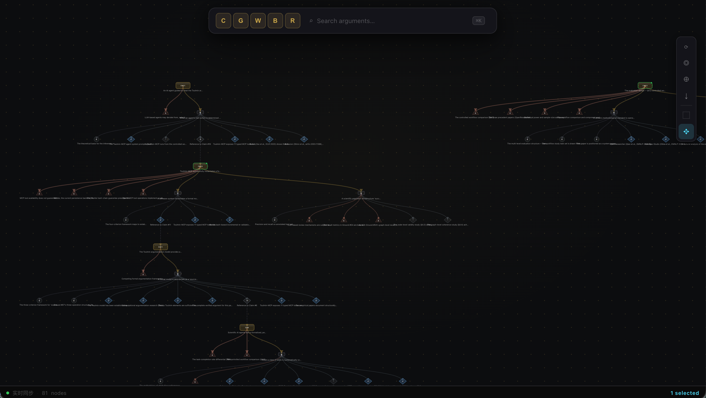

# Warranted

让 AI Agent 的科研推理可被审计——每一个结论都有可追溯的论证图。

> [English](README.md) | [简体中文](README.zh-CN.md)

---

## 它解决什么问题

编程 Agent 能收敛，因为编译器和测试提供了客观的失败信号。科研没有等价机制——结论活在自然语言里，没有外部验证器，Agent 无从得知自己还缺什么，轻易宣告完成。

**Warranted** 填补这一空缺，给 Agent 提供一套**持久化的论证图**：每个主张（Claim）必须有证据（Ground）和推理链（Warrant），矛盾记录为 Rebuttal 而非抹掉，状态推进前必须通过逻辑审查（compile）。研究推理因此变得可审计、可复现、可验证。

适合的场景：**论文复现、假设验证、多步骤科学推理、研究透明度**。




---

## 文档

第一次来？按这个顺序读：

| 文档 | 讲什么 |
|------|--------|
| [论证图](docs/zh-CN/concepts.md) | 核心概念——五种节点、`compile`、状态生命周期，以及如何用论证图的语言跟 Agent 沟通。**从这里开始。** |
| [复现一篇论文](docs/zh-CN/reproduce-a-paper.md) | 场景指南：用一张独立的论证图验证论文主张（`/paper-reproduce`、`declare-barrier`）。 |
| [写一篇论文](docs/zh-CN/write-a-paper.md) | 场景指南：写论文或文献综述，让每处引用都能追溯到一个 verified 的 Ground（`/overleaf-setup`、`/literature-survey`）。 |

更新历史：[CHANGELOG.md](CHANGELOG.md)

---

## 接入 Claude Code

**1. 克隆并配置**

安装 [Bun](https://bun.com/docs/installation)（>= 1.0.0），然后：

```bash
git clone https://github.com/yqi96/warranted
cd warranted

# 可选：启用 LLM 逻辑审查
cp review.json.example review.json
# 编辑 review.json，填入 apiKey
```

**2. 注册 marketplace（每台机器只需一次）**

```bash
claude plugin marketplace add $(pwd)
```

**3. 在你的项目里安装 plugin**

```bash
cd your-project
claude plugin install warranted@warranted --scope local
```

启动后自动以 `toulmin-researcher` 为主 Agent，MCP server 随之拉起。

启用 LLM 审查后，创建节点时自动触发节点定义审查，`compile_arguments` 执行完整逻辑链审查。

> 安装或版本有问题？见 [已验证的依赖版本](docs/reference/known-working-versions.md)。

## 可视化

在 `warranted` 目录下运行：

```bash
bun run viz
```

打开浏览器访问 `http://localhost:3456` 查看论证图。

### 交互操作

| 操作 | 效果 |
|------|------|
| 单击节点 | 选中节点（高亮青色光环） |
| 双击节点 | 打开底部详情面板 |
| Shift + 单击 | 追加/取消选中（多选） |
| 框选（box 模式） | 拖动画框，框内节点全部选中 |
| 拖动画布（pan 模式） | 平移视图 |
| 滚轮 | 缩放 |
| 点击空白处 | 取消选中 |

工具栏右侧的 **⬚ / ✥** 按钮切换"框选模式"和"拖动模式"。

### 选中即上下文

可视化服务器会记住当前选中的节点。启动 plugin 后，**每次向 Claude 发送指令时，所选节点会自动注入到提示上下文**——无需手动描述"对哪些节点操作"，选好再说即可。

---

## 包含的 Agents

| Agent | 作用 |
|-------|------|
| `toulmin-researcher` | 主力 Agent。构建和验证论证图，识别结构缺口，驱动每个 Claim 走向有据可查的结论。 |
| `toulmin-explorer` | 只读浏览。快速查找节点、查看验证状态、探索论证结构，不做修改。 |

---

## 包含的 Skills

| Skill | 触发方式 | 作用 |
|-------|----------|------|
| `paper-reproduce` | `/paper-reproduce` | 论文复现工作流。构建独立论证图，逐步验证论文主张是否成立。 |
| `declare-barrier` | `/declare-barrier` | 形式化声明任务阻塞。声明无法继续前，系统检查所有已知的假性阻塞模式。 |
| `literature-survey` | `/literature-survey` | 文献综述工作流。将外部发现接入论证图作为 Ground，用 LaTeX 以 `\cite{ground_N}` 引用写作，全程维护 `.bib` 文件。 |
| `overleaf-setup` | `/overleaf-setup` | 一次性配置 skill。安装 `leaf`、完成认证、把本地 LaTeX 目录关联到 Overleaf 项目，并写入一个 Stop hook，在每轮对话结束时自动推送（无文件改动则跳过）。 |
